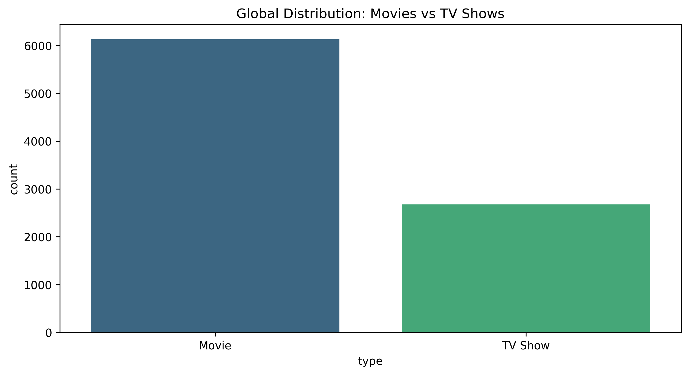
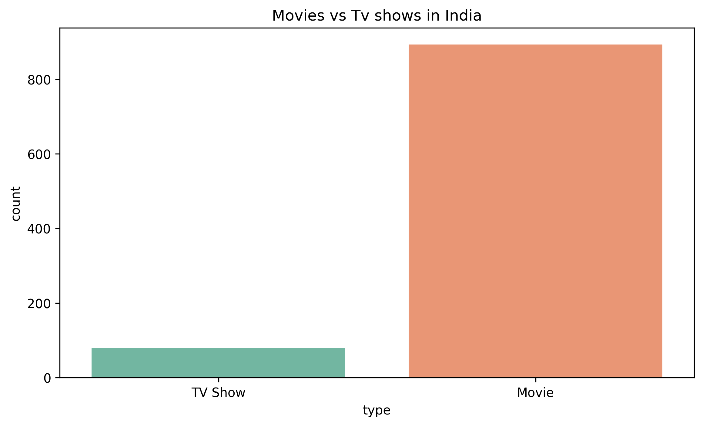
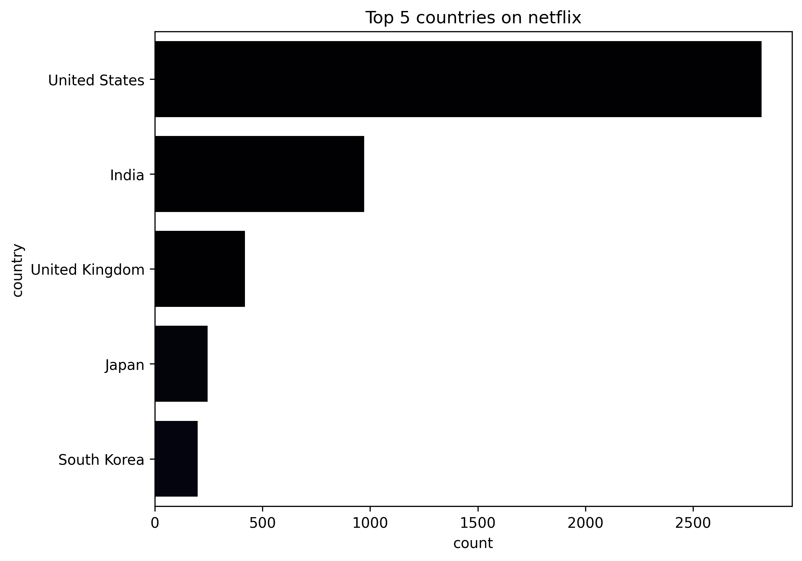

# Netflix Data Analysis Project

## Project Overview
This project analyzes the Netflix dataset using Python to explore trends, content distribution, and insights about movies and TV shows available on Netflix.

## Tools and Technologies
- Python
- Pandas
- NumPy
- Matplotlib
- Seaborn
- Jupyter Notebook

## Dataset
The dataset contains information about Netflix titles such as type, country, release year, rating, and duration.

## Key Analysis
- Distribution of Movies vs TV Shows
- Top Countries producing Netflix content
- Content release trend over the years

## Project Structure
Netflix-Data-Analysis
│
├── data
│   └── netflix_titles.csv
├── notebook
│   └── Netflix_Data_Analysis.ipynb
├── images
│   ├── graph1.png
│   ├── graph2.png
│   └── graph3.png
└── requirements.txt

## Conclusion
This project helps understand Netflix content trends using data analysis and visualization.

### Graphs

#### 1. Global Distribution of Content

#### 2. India Content Trend

#### 3. Top 5 Countries

